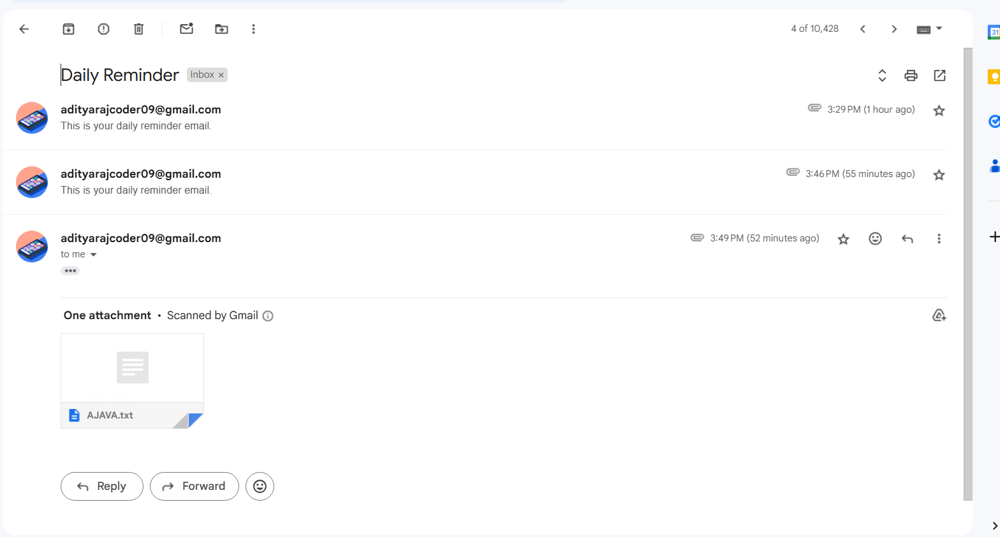
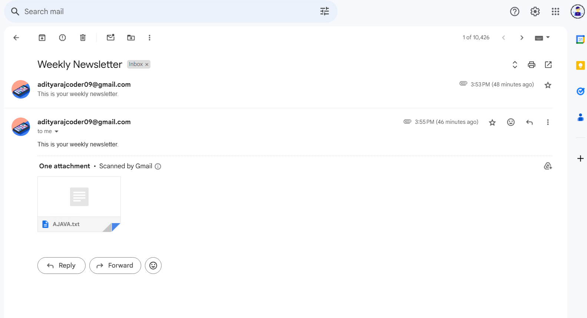

# Task: Designing an Automated Email Scheduling API


## Installation
1. Clone the repository
```bash
    git clone https://github.com/adityakhachar/shipments.git
```

2. Install the package
```bash
    git install
```
3. Start the server
```bash
    nodemon index.js
```

## Screenshots

### Mail (Daily Basis) 


### Mail (Weekly Basis)



## Api's

1. Create new Schedule[POST]
```bash
    https://shipments.onrender.com/email/scheduled-emails
```
2. Get list of Schedule[GET]
```bash
    https://shipments.onrender.com/email/scheduled-emails
```
3. Fetch Scheduled mail by Id[GET]
```bash
    https://shipments.onrender.com/email/scheduled-emails/66aca314211e4e80e7ec034e
```

4. Delete Scheduled mail by Id[DELETE]
```bash
    https://shipments.onrender.com/email/scheduled-emails/66aca314211e4e80e7ec034e
```
